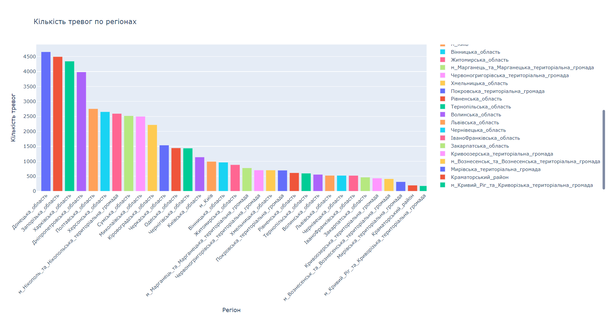
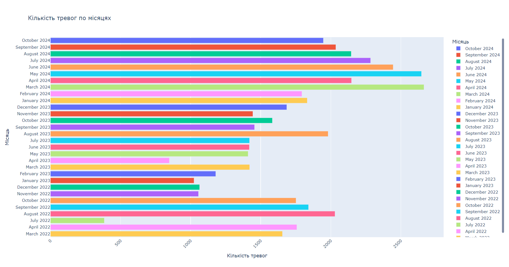

# Air Alert Analysis

## Overview
The Air Alert Analysis project is a data processing and visualization tool that 
analyzes air alert notifications across different regions and timeframes. 
The data is stored in JSON format and is visualized through interactive bar charts. 
The data is taken from [kaggle.com](https://www.kaggle.com/datasets/dimakyn/air-alarm-ukrain-2022022420220409/).
The project highlights the frequency of alerts by region and by month.

## Features
- **Data Collection:** Aggregates and parses air alert data from multiple JSON files.
- **Data Visualization:** Generates interactive bar charts that display:
  - Air alerts by region (only regions with more than 100 alerts).
  - Monthly air alerts with a timeline.
- **Customizable Filtering:** Data can be filtered based on specific criteria, such as regions with a high frequency of alerts.

## Project Structure
```bash
.
├── main.py                # Main script to execute data processing and visualization
├── compare_data.py        # Helper functions to read, parse, and filter JSON data
└── archive/               # Folder containing JSON files with air alert data (taken from kaggle.com)
```
## Installation
### Clone the repository:
```
git clone https://github.com/Grister/Air_Alert_Graphs.git
cd Air_Alert_Graphs
```
### Create and activate a virtual environment:
```
python -m venv venv
source venv/bin/activate  # for Linux/Mac
venv\Scripts\activate  # for Windows
```
### Install required packages:
```
pip install -r requirements.txt
```
## Code Explanation
`main.py`
- `collect_alerts()`: Collects and consolidates data from JSON files in the archive folder using get_data() from compare_data.py.
- `graph_by_region(data)`: Groups and filters data by region, displaying regions with more than 100 alerts in a bar chart.
- `graph_by_year(data)`: Groups data by month and year, creating a timeline of alerts by month.
- `main()`: Orchestrates the data collection and visualization functions.

`compare_data.py`
- `read_json(file_name)`: Reads JSON files and returns the data.
- `write_json(data)`: Saves processed data to alerts.json.
- `get_data(file)`: Extracts relevant alert information (date, region, and alert status) from each JSON file.
- `get_instance(date, data)`: Processes each message, identifying the region and alert type based on specific markers.
- `get_alert_flag(text)`: Determines alert status based on symbols ("🔴" for "air alert", "🟢" and "🟡" for "all clear").

## Example Graphs
### Alerts by Region:
Shows regions with over 100 alerts.


<br>

### Alerts by Month:

Displays alert frequency by month, formatted with month names for easy readability.


<br><br><br>